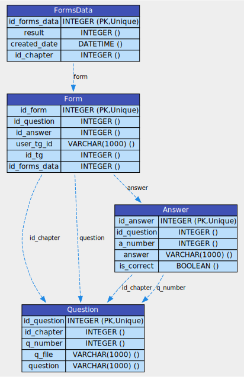

Для построения опросника по главам и записи результатов используется СУБД PostgreSQL. Стуктура и способы взаимодействия с БД описаны с помощью библиотеки SQLAlchemy, с использованием асинхронного движка.
<figure markdown="span">
  { width="300" }
  <figcaption>ER-диаграмма модели опросника</figcaption>
</figure>

Ключевые сервисы хранятся в файлах: <br>
1. :fontawesome-brands-python: _create_data_service.py_ <br>
2. :fontawesome-brands-python: _get_data_service.py_ <br>

Для заполнения и извелечения информации из таблиц соответственно. <br>
Примеры:
```py
@enter_session
async def add_questions_and_answers(form: dict, **kwargs):
    session = kwargs.pop('session')
    rep = FormRepository(session)
    try:
        for question_data, answers in form.items():
            try:
                question_data[3]
            except IndexError:
                res = await rep.add_question(id_chapter=question_data[0], q_number=question_data[1],
                                             question=question_data[2])
            else:
                res = await rep.add_question(id_chapter=question_data[0], q_number=question_data[1],
                                             question=question_data[2], q_file=question_data[3])
            for a_number, answer, is_correct in answers:
                await rep.add_answer(id_question=res.id_question, a_number=a_number, answer=answer, is_correct=is_correct)

    except Exception as e:
        print(e)
        print('Ошибка при записи вопросов и ответов в бд')

```

```py
@enter_session
async def get_questions_by_chapter(id_chapter, **kwargs) -> Optional[list]:
    session = kwargs.pop('session')
    rep = FormRepository(session)
    try:
        questions = await rep.get_questions_by_chapter(id_chapter)
        result = [
            question_answers_to_dict(question, await rep.get_answers(id_question=question.id_question))
            for question in questions
        ]
        return result if result else None
    except Exception as e:
        print(e)
        print('Ошибка при получении вопросов и ответов из бд')
        return None

```

Дополнительные функции преобразования, для работы со словарями в хендлерах находятся в файле :fontawesome-brands-python: _model_to_dict.py_ <br>